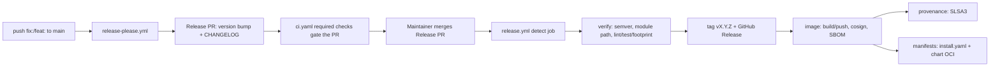

# Release flow (release-please, PR-only mode)

This follows the canonical Inari release pattern piloted in **inari-api** (M1.2 / W1), adapted
for this repo's publish targets: GHCR image (cosign-signed, SBOM, SLSA), install manifest, and
Helm chart (OCI).

## Overview



1. **Propose** — `.github/workflows/release-please.yml` runs on every push to `main`
   (`googleapis/release-please-action@v4`, `skip-github-release: true`). It ONLY opens or
   updates the Release PR: version bump in `.release-please-manifest.json` and a
   `CHANGELOG.md` diff. It never creates tags or GitHub Releases and never triggers publish.
2. **Human gate** — a maintainer reviews and manually merges the Release PR. The normal CI
   (`ci.yaml`: lint, test, footprint-guard, kind-e2e) runs on the PR via the `pull_request`
   trigger and must be a required check.
3. **Execute** — `.github/workflows/release.yml` runs on push to `main`. Its `detect` job
   proceeds only when the head commit matches `^chore(\(main\))?: release` **or**
   `.release-please-manifest.json` changed in the push. It then reads the version from the
   manifest, verifies (semver, go module path vs major version, lint/test/footprint), creates
   and pushes tag `vX.Y.Z`, creates the GitHub Release with the changelog section as body, and
   runs the publish jobs:
   - `image` — multi-arch build/push to `ghcr.io/7k-inari/inari-agent:vX.Y.Z` (`:latest` only
     for stable releases), cosign keyless sign, SBOM generation + attestation.
   - `provenance` — SLSA3 container provenance via slsa-github-generator.
   - `manifests` — renders `dist/install.yaml` pinned to the release image (footprint-checked),
     packages and pushes the Helm chart to `oci://ghcr.io/7k-inari/charts`, and attaches
     `install.yaml` to the GitHub Release.

Per-commit edge images (`edge-<sha>`) stay in `ci.yaml` and are unaffected by releases.

## Why publish jobs live in release.yml

The tag is pushed with `GITHUB_TOKEN` inside a workflow. GitHub does not fire tag-push (or any)
triggers for `GITHUB_TOKEN`-authored events, so a separate `on: push tags: [v*]` workflow
**would never run**. Publish therefore lives inline in `release.yml`. If this repo grows many
publish targets, extract them into reusable workflows invoked via `workflow_call` from
`release.yml` — never via tag triggers.

## Config files

### `release-please-config.json`

```json
{
  "packages": {
    ".": {
      "release-type": "go",
      "changelog-path": "CHANGELOG.md",
      "bump-minor-pre-major": true
    }
  }
}
```

- `release-type: go` — Go module repo; version lives in the manifest only.
- `bump-minor-pre-major: true` — while the repo is at 0.x, `feat:` bumps minor and `fix:`
  bumps patch. **Remove this flag once the repo reaches 1.0.0** (then `feat:` → minor,
  `feat!:` → major per standard SemVer).
- The Helm chart's `Chart.yaml` is NOT managed by release-please; the `manifests` job pins
  `version`/`appVersion` at publish time, so the in-repo chart stays at its seed version.

### `.release-please-manifest.json`

```json
{ ".": "0.1.0" }
```

Seeded with the repo's starting version. Managed by release-please afterwards — never
hand-edit except to seed.

### `.github/workflows/release-please.yml` and `.github/workflows/release.yml`

Copied from the inari-api pilot; publish jobs adjusted for container/chart targets. Do not
rename: `release.yml`'s `detect` job keys off release-please's `chore(main): release` commit
subject.

## Versioning & breaking changes

- Versions are driven entirely by Conventional Commits: `fix:` → patch, `feat:` → minor
  (0.x), `feat!:` / `BREAKING CHANGE:` footer → major.
- At major ≥ 2, `go.mod`'s module path must carry the `/vN` suffix — enforced by the `verify`
  job in `release.yml`.
- Never create or push tags by hand. Never cut a GitHub Release by hand. The tag and Release
  come only from `release.yml`.

## Prerequisites

- GHCR push and cosign keyless signing use the workflow's `GITHUB_TOKEN`
  (`packages: write`, `id-token: write`) — no extra secrets needed.
- PRs created with the default `GITHUB_TOKEN` do **not** trigger `pull_request` workflows
  (GitHub restriction), so `ci.yaml` will not run on the Release PR and a required `ci`
  check would block the merge. Fix: pass a PAT via `with: token: ${{ secrets.RELEASE_PLEASE_TOKEN }}`
  in `release-please.yml` (a fine-grained PAT with contents + pull-requests on this repo),
  which makes the Release PR a normal PR gated by CI like any other.
- `main` branch protection: require the `ci` workflow checks; with the PAT above,
  release-please PRs are normal PRs and are gated the same way.

## Verifying a release

After merging a Release PR:

1. `release.yml` runs; confirm the `detect` job reports the new version.
2. Tag `vX.Y.Z` and a GitHub Release exist, with `install.yaml` attached and the changelog
   section as notes.
3. `crane digest ghcr.io/7k-inari/inari-agent:vX.Y.Z` resolves;
   `cosign verify ghcr.io/7k-inari/inari-agent:vX.Y.Z` succeeds; SBOM attestation and SLSA
   provenance are present (`cosign verify-attestation`).
4. `helm pull oci://ghcr.io/7k-inari/charts/inari-agent --version X.Y.Z` succeeds.
5. A non-release push to main leaves `detect` at `released=false` — nothing is tagged or
   published; the edge image still ships via `ci.yaml`.
